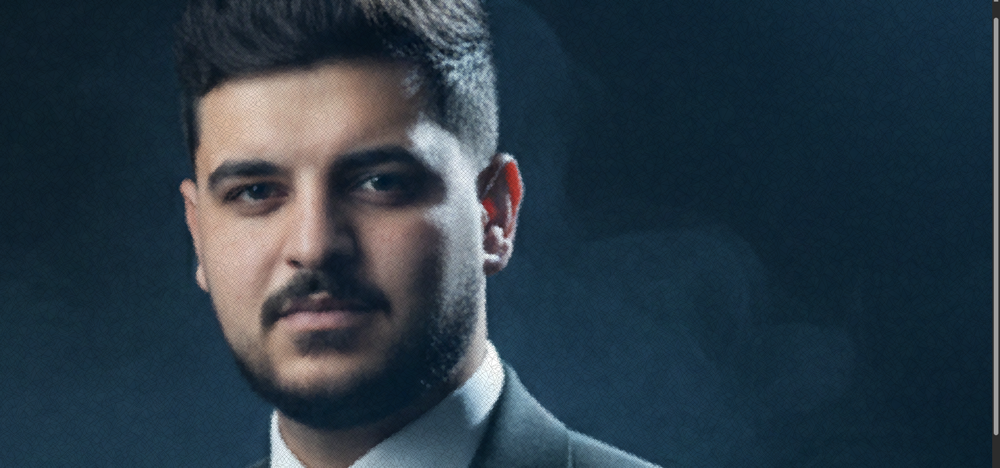

SATR: Space-Aware Triangulation & Rendering
SATR is an open-source geometric engine designed to transform rasterized human portraits into high-fidelity, resolution-independent vector meshes. Unlike standard image-tracing tools, SATR utilizes Adaptive Sampling to prioritize anatomical features, ensuring that critical details like eyes, lips, and contours maintain perfect sharpness at any zoom level.

🔬 Core Methodology
I. High-Frequency Feature Detection
The engine begins by analyzing the source image using Sobel operators and gradient magnitude mapping. This identifies "regions of interest" where color transitions are sharpest, signifying crucial facial landmarks.

II. Adaptive Point Distribution (The SATR Logic)
Instead of a uniform grid, the algorithm employs a non-linear sampling density. By concentrating vertices in high-gradient areas and sparsifying them in low-frequency regions (like the forehead or background), SATR achieves a lightweight yet hyper-detailed representation.

III. Delaunay Mesh Synthesis
Vertices are interconnected using Delaunay Triangulation to create a non-overlapping, topologically sound manifold. This geometric structure allows for "Infinite Zoom" without the artifacts typical of pixel-based upscaling.

IV. Gouraud-Style Color Interpolation
To achieve a "lifelike" appearance, SATR implements a custom color interpolation logic. By calculating gradients between vertices, the engine eliminates the "low-poly" faceted look, resulting in smooth, continuous skin tones that mimic the original photograph.

🚀 Key Advantages
Resolution Independence: Scalable to any dimension (Billboard size to Icon size) without quality loss.

Semantic Awareness: Focuses computational power on facial features rather than background noise.

Web-Ready: Exports directly to optimized SVG formats, making it ideal for modern, responsive web design.

📂 Repository Structure
/core: The main Python implementation of the SATR algorithm.

/examples: Sample SVG outputs and comparison benchmarks.

/optimization: Scripts for coordinate precision reduction and file-size compression.
🛠 Getting Started
Follow these instructions to get a local copy of SATR up and running on your machine.

Prerequisites
You will need Python 3.8+ and the following libraries:

numpy (Numerical processing)

opencv-python (Image analysis)

scipy (Geometric triangulation)

Installation
Clone the repo:

Bash
git clone https://github.com/your-username/SATR-Algorithm.git
cd SATR-Algorithm
Install dependencies:

Bash
pip install numpy opencv-python scipy
🚀 Usage
You can run the engine on any portrait. Simply place your image in the project folder and run:

Python
from satr_engine import SATREngine
## 🖼 Results Gallery
Here are some samples generated by the SATR engine:

